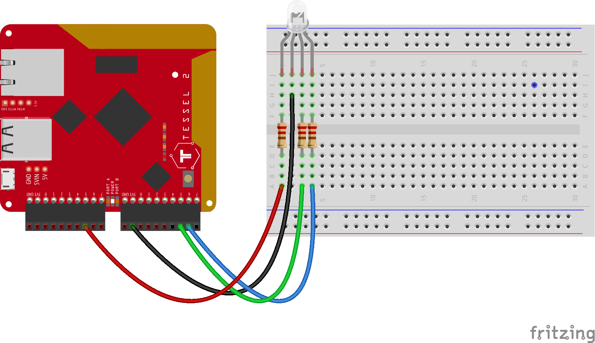

# t2-rgb-led-rainbow

This repo contains everything necessary to color cycle through a rainbow of
colors using an RGB LED, using the Tessel 2 as the hardware to drive it.

It was initially just a little experiment to get an RGB LED working, but then I
felt like making a repo, and then a diagram, and well now you get this README
and such too. Fun times.

## Prerequisites

A relatively recent version of Node (anything 4.x+ is likely fine, I was using
5.10 during experimenting).

## Dependencies

- [Johnny-Five](http://johnny-five.io/): Could I have done this without J5?
  Probably. Still makes life easier, makes the code more readable, and it's fun.
- [tessel-io](https://github.com/rwaldron/tessel-io): The IO board driver so
  that J5 can work with the Tessel 2.

## Getting Started

First, you'll want to wire things up like so:

To adequately control an RGB LED, you need PWM pins. The Tessel [Hardware API
documentation](https://tessel.io/docs/hardwareAPI) indicates that pins 5 and 6
on each module port are PWM, so I've used pin 5 on port A for Red, and pins 5
and 6 on port B for Green and Blue, respectively.

Once you have things wired up, it's pretty straight forward!

1. `npm install`
2. `npm start`
3. Enjoy the rainbow!

## Known Problems

While I can `t2 run index.js` just fine, I can't seem to `t2 push index.js`. It
builds, it issues an error and tells me to open an issue (which I may, want to
investigate a bit first), it lights up red briefly, and the whole thing shuts
down.

So, for now, it's fun to run, but you'll need to push off of a full deploy just
yet. :rimshot:

## Demo video

Here's a [terrible Vine video](https://vine.co/v/itXv2EzX1aM) which doesn't do
it justice, since, well, the LED doesn't capture nicely on camera.

Maybe if I was using something that wasn't just my phone, and I could control
exposure, but still. You get the idea.

## Common Cathode LEDs

As my RGB LED is a common anode LED, I've wired the anode (the long pin) to the
`3V3` pin of port B on the Tessel. If I were using a common cathode, I'd wire it
to the `GND` pin. I'd also remove the `isAnode: true` from the setup of the LED
in `index.js`, as you'll get odd colorings otherwise.

## Credits

Fritzing sketch of the Tessel 2 from the
[tessel-io](https://github.com/rwaldron/tessel-io) repository.
